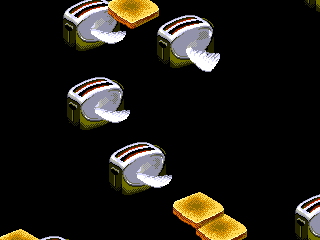
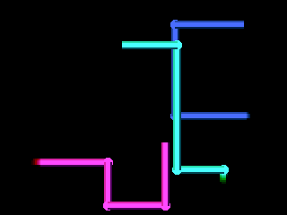
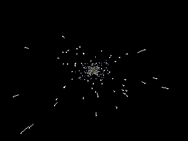
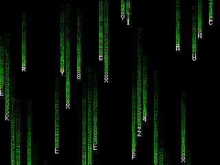
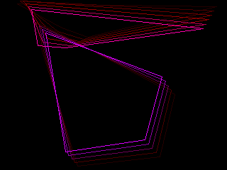

# CoreS3 SE Arduino Projects

A collection of visual apps and screensavers for the [M5Stack CoreS3 SE](https://docs.m5stack.com/en/core/CoreS3%20SE), built with PlatformIO and Arduino.

## Screenshots

The active app is **Classic Screensavers** -- 6 modes that auto-cycle with fade transitions. Tap the screen to skip to the next mode.

| | |
|---|---|
|  |  |
| **Flying Toasters** -- After Dark homage with animated wing sprites | **Pipes** -- 3D-shaded pipes growing with round elbow joints |
|  |  |
| **Starfield** -- 500 stars with perspective projection and motion streaks | **Matrix Rain** -- Falling green characters with glowing heads and fade trails |
|  |  |
| **Mystify** -- Bouncing quadrilaterals with color-cycling ghost trails | **DVD Logo** -- The classic bouncing logo, color changes on each edge hit |

## Requirements

- **Hardware:** M5Stack CoreS3 SE (ESP32-S3, 320x240 IPS, 16MB flash)
- **Software:** [PlatformIO](https://platformio.org/) (CLI or VS Code extension)
- **Python 3** with [Pillow](https://pillow.readthedocs.io/) (only needed for sprite conversion scripts)

## Quick Start

Clone the repo, plug in the CoreS3 SE via USB-C, and:

```bash
pio run -t upload
```

This builds and flashes the **Classic Screensavers** app (the current `src/main.cpp`).

To monitor serial output:

```bash
pio device monitor
```

## Apps

Each app is a standalone `main.cpp`. To run a different app, copy its `main.cpp` into `src/` and build.

| App | Description | How to Install |
|---|---|---|
| **Screensavers** (active) | 6 classic screensaver modes with auto-cycling | `pio run -t upload` |
| **Generative Art** | Plasma, flow field particles, moire rings, cellular drift | `cp apps/genart/main.cpp src/main.cpp && pio run -t upload` |
| **Weather Station** | OpenWeatherMap display with icons (requires WiFi config) | See [Weather Setup](#weather-station) below |
| **Mini TV** | Plays RGB332 video files from SD card | `cp apps/minitv/main.cpp src/main.cpp && pio run -t upload` |
| **Bouncing Bubbles** | Physics-based elastic collision demo | `cp apps/bubbles/main.cpp src/main.cpp && pio run -t upload` |
| **Analog Clock** | Smooth analog clock with shadows and digital readout | `cp apps/clock/main.cpp src/main.cpp && pio run -t upload` |
| **Vortex** | Hypnotic recursive spiral zoom effect | `cp apps/vortex/main.cpp src/main.cpp && pio run -t upload` |

### Weather Station

The weather app requires WiFi credentials and an OpenWeatherMap API key:

1. Copy the weather app files into place:
   ```bash
   cp apps/weather/main.cpp src/main.cpp
   cp apps/weather/weather_icons.h src/
   ```
2. Edit `apps/weather/config.h` with your WiFi SSID/password, [OpenWeatherMap API key](https://openweathermap.org/api) (free tier works), and city name.
3. Build and flash:
   ```bash
   pio run -t upload
   ```

### Mini TV

Requires RGB332-encoded `.bin` video files on a microSD card. Use `convert_video.py` to convert source video:

```bash
python convert_video.py input.mp4
```

## Screensaver Controls

- **Tap screen** -- Skip to next mode
- **Auto-cycle** -- Modes transition every 45-90 seconds with a fade-to-black effect
- **NeoPixels** -- The 10 side LEDs glow with colors sampled from the display

## Sprite Conversion Tools

The screensaver app includes two Python scripts for converting images to embedded sprite data:

- `convert_sprites.py` -- Converts the flying toaster sprite sheet (`toasters_and_toast.png`) to `src/toaster_sprites.h` (RGB332 pixel data + 1-bit alpha masks)
- `convert_dvd_logo.py` -- Converts the DVD logo (`dvdlogo.png`) to `src/dvd_logo.h` (1-bit alpha mask for runtime colorization)

These only need to be re-run if you change the source images. The generated headers are already checked in.

## Screenshot Feature

A built-in BMP screenshot feature is included but disabled by default. To enable it:

1. In `src/main.cpp`, uncomment `#include <SD.h>` and set `ENABLE_SCREENSHOTS` to `1`
2. Insert a microSD card
3. Build and flash
4. Press **BtnB** (bottom-center touch area) to save a 24-bit BMP to the SD card
5. NeoPixels flash white to confirm each capture

## Project Structure

```
src/
  main.cpp              Active app (currently: screensavers)
  toaster_sprites.h     Generated toaster/toast sprite data
  dvd_logo.h            Generated DVD logo alpha mask
  homer_data.h           Embedded video frame data
apps/
  genart/main.cpp       Generative art frame
  weather/              Weather station (main.cpp, config.h, weather_icons.h)
  minitv/main.cpp       SD card video player
  bubbles/main.cpp      Bouncing balls physics demo
  clock/main.cpp        Analog clock
  vortex/main.cpp       Spiral vortex effect
screenshots/            Screensaver mode captures
convert_sprites.py      Toaster sprite sheet converter
convert_dvd_logo.py     DVD logo converter
convert_video.py        Video-to-RGB332 converter
platformio.ini          PlatformIO build config
```
